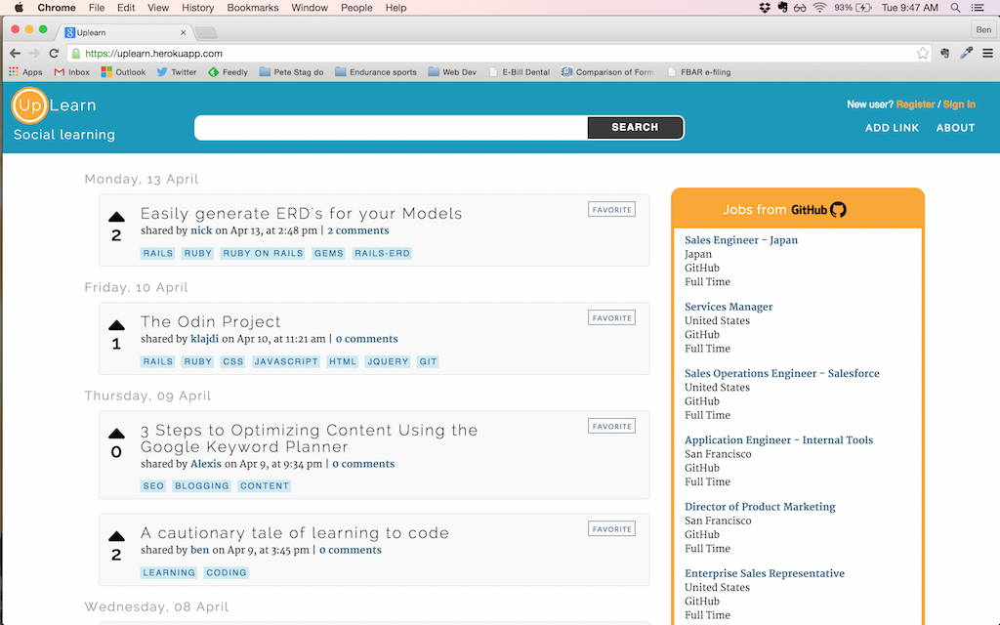

# UpLearn

## What is it?

UpLearn (https://uplearn.herokuapp.com/) is a place to find and share the best digital learning resources. Each day new links are added and upvoted by the community. Join us so you can favorite resources for future reference. UpLearn is a community-driven site, so please join and contribute useful resources you've found.

More details are available on the app's about page: https://uplearn.herokuapp.com/about

## Who?

This app was created by Ben Collins as a final project for General Assembly's Back End Web Development course in Washington, DC (Jan 2015 cohort).

## Notes on the build

#### Intro

This app is built using the Ruby on Rails Framework hooked up to a Postgresql database and hosted on Heroku. The front end is built using Sass and pure CSS, organized along the lines of Jonathan Snook's SMACSS architecture.

#### Details

Ruby Version: ruby-2.1.2

#### Gems

This project uses a number of Gems but I've tried to not go crazy here to keep dependencies to a minimum and protect the app from conflict issues in the future. In addition to those that Rails ships with, I'm using the following gems:

* Pry-Rails: for testing during development
* Httparty: for calling APIs
* Devise: for handling user authentication
* Browshot: service for handling the screenshot API calls
* Kaminari: for handling pagination in the app
* closure_tree: for handling nesting of the comments
* dotenv-rails: for handling proprietary or sensitive data in app (e.g. an API key) and keeping hidden on GitHub
* rails_12factor: gem from Heroku to manage the deployment of static assets when hosting with Heroku

#### APIs

This app uses three API's to get information from third parties: firstly, a screenshot grabbing API so I can display a screenshot of the tutorials; secondly, the GitHub jobs API to pull jobs into the sidebar; and, thirdly, the Wordpress Gravatar API to pull in a user's avatar based off their email.

#### Feature wishlist

These are features I'm looking to implement going forward. Some I'm working on right now, some are just items on the list. Adding this functionality should address the limitations of the app.

* Gatekeeper or spam reporting button to avoid spam links being posted
* Store the screenshot images to a 3rd party, such as Amazon S3
* User reputation system, based off how many upvotes and favorites the user gets on the resources they have submitted
* Recommendation system to surface other resources that a user might find interesting
* Javascript to test if a screenshot image is ready, and if not, keep trying the API every couple of seconds until the image is ready
* Caching to speed up the app
* Make the front-end mobile friendly
* Refactor the code!

More details are available on the app's about page: https://uplearn.herokuapp.com/about
